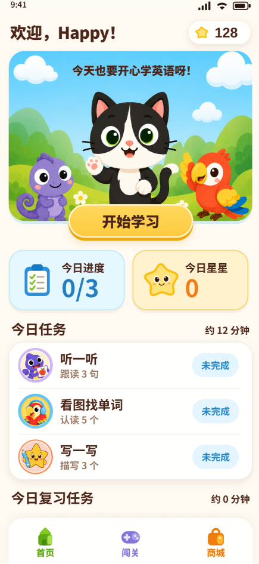
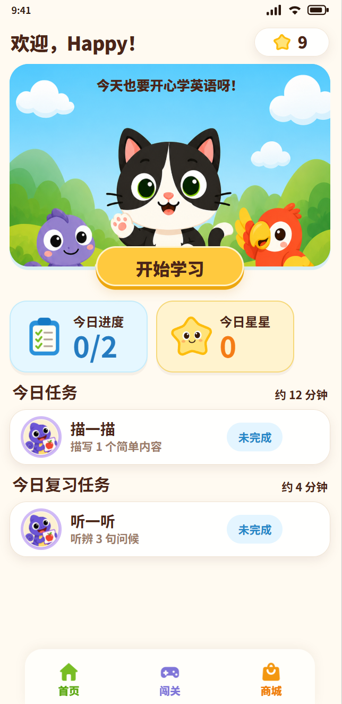

# UI设计走查报告｜Happy 英语儿童首页

- 走查日期：2026-08-09
- 页面：儿童首页
- 范围：设计稿截图与当前 HTML 首页截图
- 结论性质：只审计，不修改 HTML、Figma 或 APK

## 1. 走查证据

### 图1：设计稿

### 图2：HTML实现

设计截图为 435 × 945，来源画板基准为 390 × 844；HTML截图为 644 × 1321，对应当前页面约 430 CSS px 的外壳。星星数量、任务数量、任务名称和复习内容属于动态业务数据，本报告不把这些差异计入问题。

## 2. 走查总览

- 设计还原度：良好
- 综合评分：81 / 100
- 问题数量：共5个
- 高：2个
- 中：3个
- 低：0个

### 评分明细

|维度|得分|满分|说明|
|-|-:|-:|-|
|布局结构|17|25|页面结构一致，但390与430基准不一致引发全局比例偏移|
|颜色体系|19|20|品牌蓝、黄、棕、卡片底色和状态色基本一致|
|Typography|14|15|标题、数据、任务名称层级接近设计稿|
|组件一致性|13|15|卡片、按钮和状态标签外观接近，但点击热区不符合儿童端要求|
|间距体系|10|15|固定列宽在430px下产生明显多余留白|
|细节还原|8|10|圆角、阴影和图标方向接近，响应式比例仍需收口|

## 3. 已确认的优点

1. 欢迎标题、星星入口、主视觉、指标卡、任务区和底部导航的结构顺序与设计稿一致。
2. 蓝色主视觉、黄色主按钮、奶油色背景和深棕文字已形成一致的儿童绘本风。
3. 主要按钮的胶囊形态、描边和底部阴影接近设计稿，视觉焦点明确。
4. 今日进度与今日星星的数据层级清晰，任务状态标签容易识别。
5. 底部导航保持绿色、紫色、橙色的入口语义。

## 4. 问题清单

|编号|严重程度|位置|问题维度|设计稿表现|实现表现|修改建议|
|-|-|-|-|-|-|-|
|1|高|整个儿童首页|布局与响应式|设计基准为390 × 844，主要宽度、主视觉比例和364px底部导航均围绕390px画板建立|HTML的 .app-shell 最大宽度为430px，但多数组件仍保留390px画板下的固定尺寸，导致主视觉变宽变扁、按钮相对变小、指标卡和任务内容右侧出现空白|当前走查版本先将首页外壳收口到390px；如需支持430px，应把主视觉高度、指标列宽、任务中栏和底部导航改为响应式约束，不能只放宽外壳|
|2|高|顶部星星入口、任务状态按钮|儿童可点击性|视觉按钮可保持36px高，但儿童端规范要求实际点击区域不小于48 × 48px|.home-star-balance 和 .home-task-row .status 的实际高度均为36px，且没有独立48px热区容器|保留36px视觉胶囊，在外层或伪元素上扩展至至少48px点击热区；保证相邻目标之间仍有足够间距|
|3|中|今日进度、今日星星卡|间距与对齐|两张卡片等分内容宽度，左右边距对称|网格使用固定 173.35px 173.35px；在430px外壳下不能填满可用宽度，右侧出现约46px未分配空间|改为 grid-template-columns: repeat(2, minmax(0, 1fr))，保留10.7px间距|
|4|中|今日任务与复习任务行|组件内部布局|图标、文案、状态标签形成稳定三段布局，状态标签靠近卡片右侧|任务文案固定为186px；在430px外壳下状态标签后方出现过大留白，内部视觉重心偏左|任务文案改为 flex: 1; min-width: 0，状态标签保持固定宽度并增加 margin-left: auto|
|5|中|底部导航与状态文字|可访问性|色彩延续品牌语义，同时应保证小字号文字可读|底部导航绿、紫、橙文字与浅色背景的对比度约为2.91、3.78、2.72；未完成状态蓝色文字约3.50，低于小字号正文常用的4.5:1目标|图标可保留原色；导航文字和14px状态文字使用更深一级语义色，或增加字重与字号并重新核验对比度|

## 5. 建议修复顺序

1. 先统一本轮视觉验收视口为390 × 844。
2. 修复指标卡、任务行和底部导航的响应式约束。
3. 扩大星星入口与任务状态按钮的实际点击热区。
4. 调整小字号彩色文字的对比度。
5. 使用同一动态数据状态重新截图，进行第二轮视觉复核。

## 6. 代码证据

- phase2-lowfi-html/styles.css:28：.app-shell 最大宽度430px。
- phase2-lowfi-html/styles.css:936：星星按钮高度36px。
- phase2-lowfi-html/styles.css:966：主视觉宽度响应、但高度固定253px。
- phase2-lowfi-html/styles.css:1024：指标卡使用固定173.35px列宽。
- phase2-lowfi-html/styles.css:1135：任务文案固定186px。
- phase2-lowfi-html/styles.css:1151：状态按钮高度36px。
- phase2-lowfi-html/styles.css:1238：首页底部导航最大宽度364px。

## 7. 证据限制

本轮依据两张静态截图和当前 HTML/CSS 源码完成。未实际测试键盘焦点、屏幕阅读器、字体放大、横竖屏切换、Android系统安全区及真实手机触摸行为，因此不能据此声明完整无障碍合规。由于两张截图的视口不同，本报告不输出1–2px级别的像素偏差。

## 8. 走查步骤

1. 设计稿基准识别：健康。核心布局、视觉锚点和品牌样式清晰。
2. HTML截图对比：需优化。整体风格接近，但430px外壳引发级联比例偏移。
3. CSS结构核验：需优化。固定宽度与儿童点击热区问题得到源码确认。

